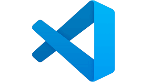

<!-- HEADINGS -->

# My Title
## My title H2
### My title h3
#### My title h4
##### my Title h5
###### My title h6


<!-- italic -->
this is an *italic* text

<!-- strong -->
this is an **strong** text

<!-- strickethrough -->
este es un  ~~texto~~ tachado

<!-- UL -->
* apple
    * apple 2
* orange
* etc

1. apple 
2. orange
3. etc


<!-- Enlaces -->
[Link del Curso de Markdown](https://www.youtube.com/watch?v=oxaH9CFpeEE "Es muy util, recuerda recomendarselo a Manuel cuando avance en programacion.")

<!-- Citas -->
> This is a quote
---
___

<!--- Bloques de codigo -->

`console.log('Hello world);`

```javascript
var pais = "Espana";
var continente = "Europa";
var antiguedad = 2019;
var pais_y_continente = pais + ' y ' + continente;
let prueba = "hola";
alert("hola");

pais = "Mexico";
continente = "Latinoamerica";


console.log(pais, continente, antiguedad);
alert(pais_y_continente);
```

```python
print("Hello world");
```

```html
<h1>Hello World </h1>
```

<!-- Tables -->

| Tables    | Are   |Cool   |
| ----------|:-----:|------:|
| Col 3 is  | Right-aligned | $1600 |
| Col 2 is  | Centered  | $12   |
| Zebra stripes | are neat  | $1    |

<!-- Images -->

---
---
---
<!-- GITHUB MARKDOWN -->
* [x] Tarea 1
* [ ] Tarea 2
* [ ] Tarea 3
* [x] Tarea 4


<!-- Comentario -->

